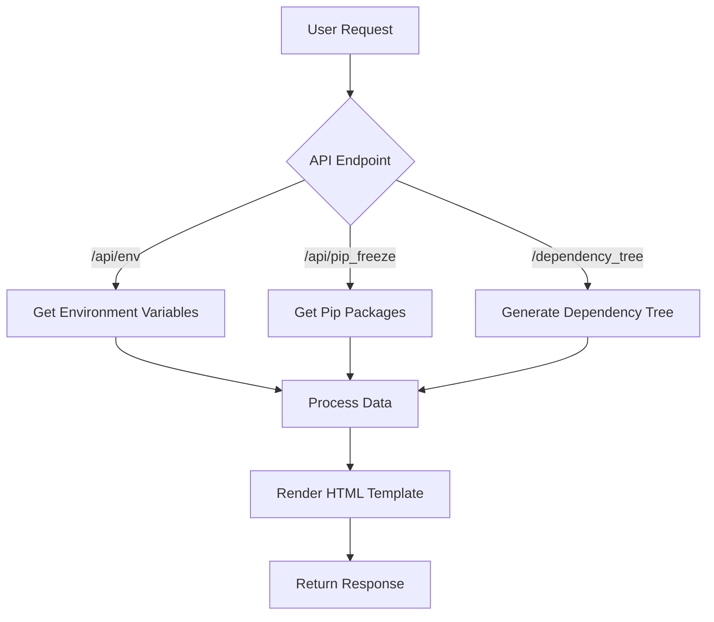

# ComfyUI_EnvAutopsyAPI

ComfyUI_EnvAutopsyAPI is a powerful debugging tool designed for ComfyUI that provides in-depth analysis of your environment and dependencies through an API interface. This tool allows you to inspect environment variables, pip packages, and dependency trees, making it easier to diagnose and resolve issues in your ComfyUI setup.

## Features

- Retrieve and display environment variables
- List installed pip packages
- Generate and visualize dependency trees
- Provide warnings about potential conflicts in your Python environment
- Serve results in various formats (HTML, JSON, plain text)
- Integrate seamlessly with ComfyUI's existing API structure

## Installation

1. Clone this repository into your ComfyUI custom_nodes directory:
 - git clone https://github.com/chrisdreid/ComfyUI_EnvAutopsyAPI.git
   
2. Install the required dependencies:
 - pip install -r requirements.txt

## Usage

Once installed, ComfyUI_EnvAutopsyAPI adds the following endpoints to your ComfyUI server:

- `/api/env`: Displays all environment variables
- `/api/pip_freeze`: Lists all installed pip packages
- `/dependency_tree`: Generates and displays the dependency tree

Access these endpoints through your web browser or API client to perform an "autopsy" on your ComfyUI environment.

## Workflow

Here's a high-level overview of how ComfyUI_EnvAutopsyAPI works:

 - The user sends a request to one of the API endpoints.
 - The corresponding function is called to retrieve the requested information.
 - The data is processed and formatted.
 - An HTML template is rendered with the processed data.
 - The response is sent back to the user.

## Contributing
Contributions to ComfyUI_EnvAutopsyAPI are welcome! Please feel free to submit pull requests, create issues or spread the word.
