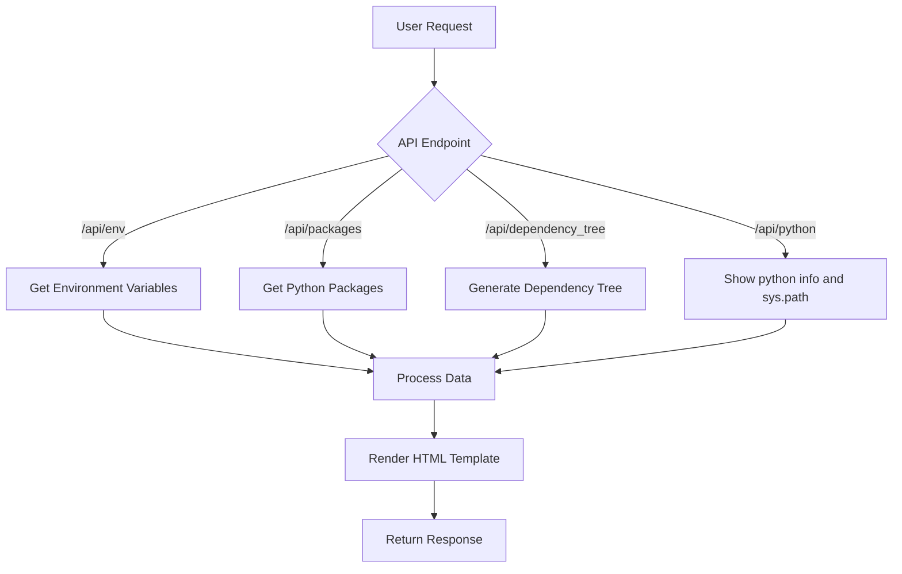

# ComfyUI_EnvAutopsyAPI

ComfyUI_EnvAutopsyAPI is a powerful debugging tool designed for ComfyUI that provides in-depth analysis of your environment and dependencies through an API interface. This tool allows you to inspect environment variables, pip packages, and dependency trees, making it easier to diagnose and resolve issues in your ComfyUI setup.

## ⚠️ WARNING: SECURITY RISK ⚠️

### ❗ This tool may expose sensitive system information if used on a public server ❗

**Important:** 
- This tool is designed for **debugging your local ComfyUI environment**.
- If your ComfyUI instance is **publicly accessible**:
  - **DO NOT** use these tools without proper security measures.
  - They can expose:
    - System environment details
    - File paths
    - Installation directories
    - Overall system configuration

**Intended Use:** 
- For personal debugging only
- On secure, private environments

**Remember:** Always prioritize your system's security when using diagnostic tools.

## Features

- Retrieve and display environment variables
- List installed pip packages
- Generate and visualize dependency trees
- Provide warnings about potential conflicts in your Python environment
- Serve results in various formats (HTML, JSON, plain text) ** JSON removed recently
- Integrate seamlessly with ComfyUI's existing API structure
- Ability to host it's own libs (**_plugin_libs**)

## Future Features

- Compare/Diff any endpoint with data passed through request or another url to access.
- Restart ComfyUI 
  - System process
  - Docker container
  - Docker container process

## Installation

1. Clone this repository into your ComfyUI custom_nodes directory:
 - git clone https://github.com/chrisdreid/ComfyUI_EnvAutopsyAPI.git
   
2. Install the required dependencies:
 - pip install -r requirements.txt

## Alternative Install of Plugin Libs
In order to make the plugin run without the dependencies pip installed into your comfyui environment, we have set up a way to pip install
into a self contained directory with the plugin. This plugin will automatically add it to the PYTHONPATH and you should be good to go. 

1. Create a directory in your ComfyUI_EnvAutopsyAPI directory root. like so: `ComfyUI_EnvAutopsyAPI/_plugin_libs`
2. Run: `pip install -r requirements.txt --target ComfyUI_EnvAutopsyAPI/_plugin_libs`
3. If this file exists `_plugin_libs/pipdeptree/__main__.py` then you should be good to go.
4. If that does not work, add the `_plugin_libs` path to your PYTHONPATH.
- Example Plugin Lib Path: `./ComfyUI/custom_nodes/ComfyUI_EnvAutopsyAPI/_plugin_libs`
- Windows: `SET PYTHONPATH=%PYTHONPATH%;./ComfyUI/custom_nodes/ComfyUI_EnvAutopsyAPI/_plugin_libs`
- Linux: `export PYTHONPATH=$PYTHONPATH:./ComfyUI/custom_nodes/ComfyUI_EnvAutopsyAPI/_plugin_libs`

You can also create a comfyui startup script or update the PYTHONPATH in your startup script. See docs

## Usage

Once installed, ComfyUI_EnvAutopsyAPI adds the following endpoints to your ComfyUI server:

- `/api/env`: Displays all environment variables
- `/api/pip_freeze`: Lists all installed pip packages
- `/dependency_tree`: Generates and displays the dependency tree and possible conflicts

Example Url: http://localhost:8188/api/dependency_tree

Access these endpoints through your web browser or API client to perform an "autopsy" on your ComfyUI environment.

Dependency Tree: 
 
Dependency Tree Text-Only: 
 
Environment Variables: 
 
Pip Freeze: 
 

## Workflow

Here's a high-level overview of how ComfyUI_EnvAutopsyAPI works:

 - The user sends a request to one of the API endpoints.
 - The corresponding function is called to retrieve the requested information.
 - The data is processed and formatted.
 - An HTML template is rendered with the processed data.
 - The response is sent back to the user.

## Contributing
Contributions to ComfyUI_EnvAutopsyAPI are welcome! Please feel free to submit pull requests, create issues or spread the word.
